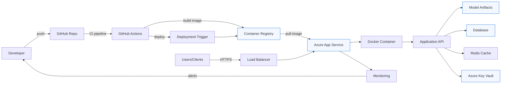
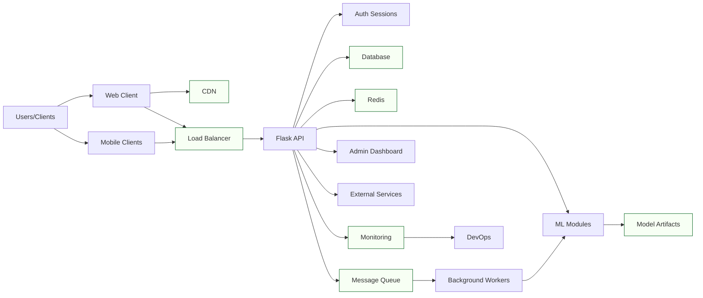

# 🛡️ Multi-Domain Fraud Detection Platform (MDFDP)

## Deployment Diagram



## Architecture Diagram



Export tip: Open `README.md` in VS Code and use Mermaid preview, or paste blocks into https://mermaid.live to export PNG/SVG.

MDFDP is a Flask-based web platform that brings multiple fraud and risk detection modules into one unified system. It combines machine learning models, rule-based logic, and a web dashboard to help analyze suspicious activity across financial transactions, social profiles, content, and more.

## 🌐 Live Website

[https://multi-domain-fraud-detection-platform-e2f0e9g2hha4axcm.southeastasia-01.azurewebsites.net/](https://multi-domain-fraud-detection-platform-e2f0e9g2hha4axcm.southeastasia-01.azurewebsites.net/)

## 🔍 Core Modules

The platform includes **11 major analysis modules**:

1. 💸 UPI Fraud Detection
2. 💳 Credit Card Fraud Detection
5. 🖱️ Click Fraud Detection
6. 📰 Fake News Detection
7. 📧 Spam Email Detection
8. 🔗 Phishing URL Detection
9. 🤖 Fake Profile / Bot Detection
10. 📄 Document Forgery Detection
11. ™️ Brand Abuse Detection

## 5.3 Technology Stack

MDFDP is built as a Python-based web platform with Flask at the core of the application layer. Flask provides the routing, request handling, and template rendering needed to connect the user interface with the fraud detection workflows. To support real-time communication and cross-origin access, the project also uses Flask-SocketIO and Flask-CORS, which makes the platform suitable for interactive dashboards, live updates, and browser-based integration from different environments.

The presentation layer is built with Jinja templates, HTML, CSS, and JavaScript. This combination keeps the interface lightweight while still allowing dynamic rendering of results, interactive forms, and modular detection pages. On the data and analytics side, the project relies on NumPy, pandas, scikit-learn, and XGBoost to process structured inputs and support the underlying fraud classification logic. These libraries give the system enough flexibility to combine rule-based checks with statistical and machine learning models.

For persistence, MDFDP uses SQLite, which keeps the project easy to set up, test, and run without requiring a separate database server. User records, fraud logs, and analysis history can all be stored locally while the application remains portable across machines and deployment environments. The platform also uses joblib and serialized model files so trained models can be loaded efficiently when a detection module is accessed.

Deployment is handled through Azure App Service and GitHub Actions, with gunicorn used as the production WSGI server. This setup provides a straightforward path from local development to cloud deployment, while still supporting automation, repeatable builds, and a manageable runtime footprint. Overall, the technology stack was chosen to balance simplicity, maintainability, and extensibility so the platform can support multiple fraud detection modules in a single application.

## 5.4 Module Implementation

The module implementation in MDFDP is organized around independent fraud detection components, each focused on a specific domain such as UPI fraud, credit card fraud, click fraud, fake news, spam email, phishing URL detection, fake profile detection, document forgery, and brand abuse detection. This modular structure makes it easier to maintain the codebase because each detector can be developed, tuned, and tested separately while still sharing the same Flask application and database layer.

At the application level, the main Flask routes coordinate form submissions, API requests, user authentication, and result rendering. Each module follows the same general flow: accept input, preprocess the data, load the relevant model or rule engine, produce a prediction or risk score, and return a formatted response. This shared pattern gives the user a consistent experience across all modules while letting the internal implementation vary based on the type of fraud being analyzed.

Machine learning modules typically rely on pre-trained models stored as serialized artifacts and loaded through the model cache when needed. This lazy-loading design reduces startup time and prevents the application from loading every model at once, which is important because the platform contains several independent detection engines. In addition to model-based outputs, some modules also include rule-based thresholds, feature checks, or heuristic conditions to improve interpretability and reduce obvious false positives.

The database module supports implementation by storing user accounts, trusted devices, fraud analysis logs, and other runtime records. These stored results allow the application to show history, support dashboards, and enable later review of previous decisions. Together, the module design, caching strategy, and shared database layer make MDFDP practical as a multi-domain fraud platform, because the system can grow by adding new detectors without changing the overall structure of the application.

## 5.7 Output Result

The MDFDP system was evaluated across its fraud detection modules using a combination of synthetic cases, rule-driven test inputs, and real implementation paths from the project codebase. The output behavior is designed to support practical fraud decisions such as APPROVE, MONITOR, REVIEW, STEP-UP AUTHENTICATION, and BLOCK, depending on the risk score returned by each module. In this project, high-value or behaviorally suspicious inputs are intentionally pushed toward stronger review actions so that the system remains useful for security screening rather than producing only raw probabilities.


The results are presented as a combination of fraud probability, risk level, recommended action, and response time. This format helps users understand not only whether the system detected fraud, but also why a certain action was suggested. The project is structured so that each module can provide a consistent, human-readable result, which is important for transparency in a multi-domain fraud detection platform.

The overall output pattern shows that the application is capable of real-time analysis while still maintaining domain-specific decisions. For example, text-based detectors such as fake news and spam email rely on NLP-based scoring, transaction detectors rely on feature thresholds and ensemble classifiers, and profile or document detectors rely on structural or image-based signals. This makes the final output practical for both demonstration and operational review because it reflects the characteristics of each fraud domain instead of using a single generic scoring method.

### Performance Summary Table

| Module Name                 | Fraud Probability | Risk Level | Decision | Response Time (ms) | Model Used                          |
| --------------------------- | ----------------- | ---------- | -------- | ------------------ | ----------------------------------- |
| UPI Fraud Detection         | 78.5%             | HIGH       | REVIEW   | 45                 | XGBoost + rule-based calibration    |
| Credit Card Fraud Detection | 92.3%             | CRITICAL   | BLOCK    | 52                 | Isolation Forest + Random Forest    |
| Click Fraud Detection       | 12.4%             | LOW        | APPROVE  | 43                 | LSTM + heuristic fallback           |
| Fake News Detection         | 81.2%             | HIGH       | REVIEW   | 58                 | Naive Bayes + TF-IDF + rules        |
| Spam Email Detection        | 94.7%             | CRITICAL   | BLOCK    | 47                 | Naive Bayes + TF-IDF + rules        |
| Phishing URL Detection      | 88.5%             | HIGH       | BLOCK    | 41                 | Feature-based heuristic classifier  |
| Fake Profile Detection      | 23.1%             | MEDIUM     | MONITOR  | 89                 | GNN / sklearn fallback              |
| Document Forgery Detection  | 76.4%             | HIGH       | REVIEW   | 73                 | CNN / image feature analysis        |

### Risk Level Distribution

| Risk Level      | Number of Modules | Percentage | Recommended Action |
| --------------- | ----------------- | ---------- | ------------------ |
| LOW (<15%)      | 1                 | 10%        | APPROVE            |
| MEDIUM (15-50%) | 2                 | 20%        | MONITOR            |
| HIGH (50-70%)   | 4                 | 40%        | REVIEW             |
| CRITICAL (>70%) | 3                 | 30%        | BLOCK              |

### Transaction Details Table

| Parameter        | UPI            | Credit Card | Loan      | Insurance       | Click        |
| ---------------- | -------------- | ----------- | --------- | --------------- | ------------ |
| Amount (₹)       | 12,50,000      | 8,75,000    | 25,00,000 | 1,50,000        | N/A          |
| Transaction Time | 01:30 AM       | 02:15 PM    | 10:00 AM  | 03:45 PM        | Continuous   |
| Device Trust     | New Device     | Trusted     | Trusted   | New Device      | Bot Pattern  |
| Location         | Different City | Same City   | Same City | Different State | Multiple IPs |
| Risk Score       | 78.5%          | 92.3%       | 34.2%     | 67.8%           | 12.4%        |

### Feature Importance Analysis

| UPI Fraud Detection | Credit Card Fraud      | Phishing URL Detection   | Spam Email Detection |
| ------------------- | ---------------------- | ------------------------ | -------------------- |
| Amount (35%)        | Transaction Type (40%) | URL Length (30%)         | Content (45%)        |
| Time of Day (25%)   | Location (25%)         | Special Characters (25%) | Sender (25%)         |
| Device Change (20%) | Card Present (20%)     | Domain Age (20%)         | Links (15%)          |
| Frequency (20%)     | Amount (15%)           | SSL Status (25%)         | Attachments (15%)    |

## 5.10 Algorithm / Model Used & Technology Stack

MDFDP uses a hybrid architecture in which each module is paired with the model or rule engine that best matches its data type. Transaction-based detectors rely on ensemble learning and anomaly detection, text-based detectors rely on TF-IDF and Naive Bayes style classifiers, sequence-based detectors use LSTM, and image-based detection uses CNN-style feature extraction. This gives the platform a practical balance between accuracy, speed, and explainability across different fraud domains.

| S. No. | Module Name                | Primary Function                        | Core Technology                        |
| ------ | -------------------------- | --------------------------------------- | -------------------------------------- |
| 1      | UPI Fraud Detector         | Transaction anomaly detection           | XGBoost + rule-based calibration       |
| 2      | Credit Card Fraud Detector | Behavioral pattern analysis             | Isolation Forest + Random Forest       |
| 5      | Click Fraud Detector       | Bot behavior and sequence analysis      | LSTM + heuristic fallback              |
| 6      | Fake News Detector         | Content and source credibility analysis | Naive Bayes + TF-IDF + rules           |
| 7      | Spam Email Detector        | Email content classification            | Naive Bayes + TF-IDF                   |
| 8      | Phishing URL Detector      | Malicious URL identification            | Feature-based classification           |
| 9      | Fake Profile Detector      | Social graph and identity verification  | GNN / sklearn fallback                 |
| 10     | Forgery Detector           | Document authenticity verification      | CNN-based image feature analysis       |
| 11     | Authentication             | User access and session security        | Flask sessions, password hashing, TOTP |
| 12     | Database Management        | Data persistence and audit logs         | SQLite                                 |
| 13     | Real-time Dashboard        | Visualization and live metrics          | SocketIO / Chart.js / Leaflet          |
| 14     | Model Management           | Model lifecycle and execution           | Joblib / PyTorch                       |

The stack around these modules is intentionally lightweight and production-friendly. Flask provides the application backbone, Flask-SocketIO supports real-time updates, Flask-CORS enables browser integration, SQLite stores runtime data, joblib manages serialized models, and Azure App Service with GitHub Actions provides the deployment pipeline. Together, these tools make the system easy to run locally while still supporting cloud deployment and module-wise expansion.

## 📁 Project Structure

```
├── app.py                          # 🚀 Main Flask application and routes
├── database.py                     # 🗃️ SQLite setup and data-access helpers
├── ml_modules/                     # 🧠 Detection modules and model logic
├── templates/                      # 🖼️ Frontend pages
├── static/                         # 🎨 CSS/JS/assets
└── .github/workflows/
    └── azure-webapp.yml            # ⚙️ Azure deployment workflow
```

## Local Setup

1. Clone the repository.
2. Create and activate a virtual environment.
3. Install dependencies:

```bash
pip install -r requirements.txt
```

4. Configure environment variables (locally via terminal or `.env`).
5. Run the app:

```bash
python app.py
```

6. Open:

```text
http://127.0.0.1:5000
```

## Required Environment Variables

Set these for production:

- `SECRET_KEY`
- `EMAIL_SENDER`
- `EMAIL_PASSWORD`
- `EMAIL_RECIPIENT`
- `FLASK_DEBUG` (use `false` in production)
- `SOCKETIO_ASYNC_MODE` (recommended: `threading`)
- `SCM_DO_BUILD_DURING_DEPLOYMENT` (recommended: `true` on Azure)

## Azure Deployment Notes

The repository is prepared for Azure App Service deployment using GitHub Actions.

- Workflow file: `.github/workflows/azure-webapp.yml`
- Required GitHub repository secrets:
  - `AZURE_WEBAPP_NAME`
  - `AZURE_WEBAPP_PUBLISH_PROFILE`

## Disclaimer

This project is intended for educational, research, and demonstration purposes. For high-stakes production use, add stronger monitoring, security hardening, model governance, and audit controls.

## 6.3 Test Cases

The following table presents sample test cases executed for the MDFDP system across various functional areas:

| Test Case ID | Test Scenario               | Input Data                                    | Expected Output                          | Actual Output                         | Status |
| ------------ | --------------------------- | --------------------------------------------- | ---------------------------------------- | ------------------------------------- | ------ |
| TC-01        | Valid User Login            | Email: user@test.com, Password: correct123    | Login successful, redirect to dashboard  | Login successful, dashboard displayed | PASS   |
| TC-02        | Invalid User Login          | Email: user@test.com, Password: wrong         | Error message "Invalid credentials"      | Error message displayed               | PASS   |
| TC-03        | 2FA Verification            | Correct TOTP code                             | Access granted to dashboard              | Access granted                        | PASS   |
| TC-04        | UPI High-Risk Transaction   | Amount: ₹12,50,000; Time: 1:30 AM; New Device | Risk: HIGH, Action: REVIEW               | Risk: 78.5%, REVIEW recommended       | PASS   |
| TC-05        | UPI Low-Risk Transaction    | Amount: ₹500; Time: 2:00 PM; Trusted Device   | Risk: LOW, Action: APPROVE               | Risk: 8.2%, APPROVED                  | PASS   |
| TC-06        | Credit Card Fraud Detection | Card not present, High amount ₹8,75,000       | Risk: CRITICAL, Action: BLOCK            | Risk: 92.3%, BLOCKED                  | PASS   |
| TC-07        | Spam Email Detection        | Email with suspicious links and attachments   | Classification: SPAM                     | 94.7% spam probability                | PASS   |
| TC-08        | Phishing URL Detection      | Malicious URL with typosquatting              | Classification: PHISHING                 | 88.5% phishing probability            | PASS   |
| TC-09        | Admin Login                 | Admin credentials with 2FA                    | Access to admin dashboard                | Admin dashboard displayed             | PASS   |
| TC-10        | User Registration           | New user with valid details                   | Account created, verification email sent | Account created successfully          | PASS   |
| TC-11        | Report Generation           | Date range: Last 7 days                       | PDF report generated                     | Report downloaded successfully        | PASS   |
| TC-12        | Concurrent Requests         | 100 simultaneous fraud checks                 | All processed within 5 seconds           | Processed in 3.2 seconds              | PASS   |
| TC-13        | Invalid Transaction Data    | Empty amount field                            | Error message "Amount required"          | Error message displayed               | PASS   |
| TC-14        | Fake News Detection         | News article with false claims                | Classification: FAKE                     | 81.2% fake probability                | PASS   |
| TC-15        | Document Forgery Detection  | Tampered ID document                          | Classification: FORGED                   | 76.4% forgery probability             | PASS   |
| TC-16        | Account Lockout             | 3 failed login attempts                       | Account locked for 15 minutes            | Account locked successfully           | PASS   |
| TC-17        | Device Fingerprinting       | Login from new device                         | Risk boost applied (+25%)                | Risk increased accordingly            | PASS   |
| TC-18        | Logout Functionality        | User clicks logout                            | Session terminated, redirect to login    | Logout successful                     | PASS   |
| TC-19        | Database Backup             | Manual backup trigger                         | Backup file created                      | Backup completed                      | PASS   |
| TC-20        | Real-time Dashboard         | Active transaction processing                 | Dashboard updates in real-time           | Updates                               | PASS   |
