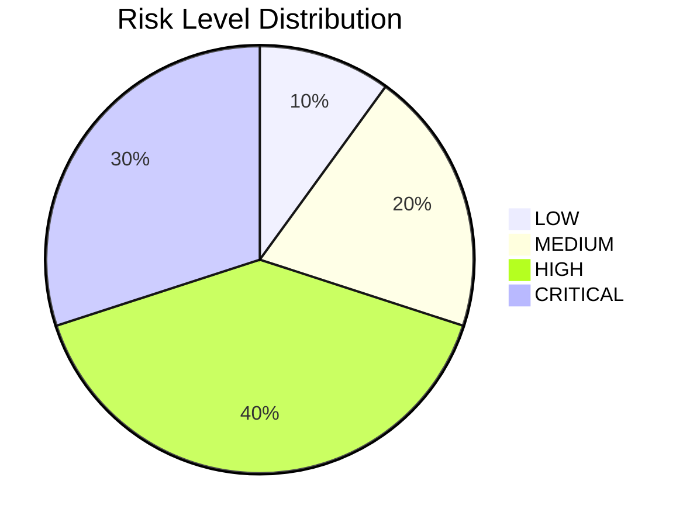
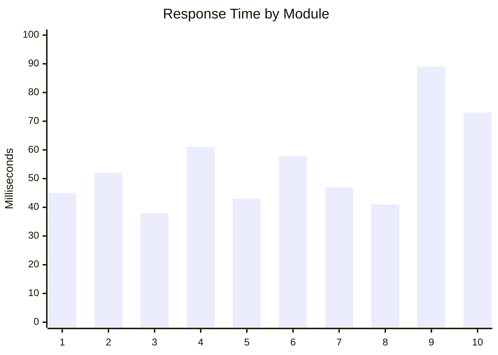

# 🛡️ Multi-Domain Fraud Detection Platform (MDFDP)

## Deployment Diagram

```mermaid
flowchart LR
  Dev[Developer]
  GH[GitHub Repo]
  CI[CI/CD (GitHub Actions)]
  Reg[Container Registry\n(ACR / Docker Hub)]
  Deploy[Deployment Trigger]
  LB[Load Balancer]
  Cluster[Hosting (Azure App Service / AKS)]
  Container[Docker Container\n(App + Gunicorn/Uvicorn)]
  App[Application API]
  Model[Model & Artifacts\n(Azure Blob Storage)]
  DB[Database\n(Azure SQL / PostgreSQL)]
  Cache[Redis Cache]
  KV[Azure Key Vault]
  Users[Users / Clients]
  Monitor[Monitoring / Logging\n(Azure Monitor / Log Analytics / Prometheus)]

  Dev --> |push| GH
  GH --> |CI pipeline: build/test| CI
  CI --> |build image| Reg
  CI --> |deploy| Deploy
  Deploy --> Reg
  Reg --> |pull image| Cluster
  LB --> Cluster
  Users --> |HTTPS| LB
  Cluster --> Container
  Container --> App
  App --> Model
  App --> DB
  App --> Cache
  App --> KV
  Cluster --> Monitor
  Cluster --> Monitor -->|alerts/logs| Dev

  subgraph Optional Components
    CDN[CDN / Static Assets]
    EmailSrv[External Email / 3rd-party APIs]
    FeatureFlags[Feature Flag Service]
  end

  App --> CDN
  App --> EmailSrv
  App --> FeatureFlags

  classDef cloud fill:#f3f7ff,stroke:#0366d6;
  class Cluster,Reg,Model,DB,KV cloud;
```

## Architecture Diagram

```mermaid
flowchart LR
  Users[Users / Clients]
  Browser[Web Client (Browser)]
  Mobile[Mobile Clients]
  CDN[CDN / Static Assets]
  LB[Load Balancer / API Gateway]
  API[Flask API (Gunicorn / Uvicorn)]
  Auth[Auth & Sessions]
  ML[ML Modules]
  ModelStore[Model Artifacts\n(Azure Blob Storage)]
  DB[Database\n(SQLite / Azure SQL)]
  Cache[Redis Cache]
  Queue[Message Queue\n(RabbitMQ / Redis)]
  Workers[Background Workers\n(Celery / RQ)]
  Admin[Admin Dashboard]
  External[External Services\n(Email, 3rd-party APIs)]
  Monitoring[Monitoring / Logging\n(Azure Monitor / Prometheus / ELK)]
  DevOps[DevOps / Alerts]

  Users --> Browser
  Users --> Mobile
  Browser --> CDN
  Browser --> LB
  Mobile --> LB
  LB --> API
  API --> Auth
  API --> ML
  ML --> ModelStore
  API --> DB
  API --> Cache
  API --> Queue
  Queue --> Workers
  Workers --> ML
  API --> Admin
  API --> External
  API --> Monitoring
  Monitoring --> DevOps

  classDef infra fill:#f7fff4,stroke:#0b6623;
  class CDN,LB,ModelStore,DB,Cache,Queue,Monitoring infra;
```

Export tip: Open `README.md` in VS Code and use Mermaid preview, or paste blocks into https://mermaid.live to export PNG/SVG.

MDFDP is a Flask-based web platform that brings multiple fraud and risk detection modules into one unified system. It combines machine learning models, rule-based logic, and a web dashboard to help analyze suspicious activity across financial transactions, social profiles, content, and more.

## 🌐 Live Website

[https://multi-domain-fraud-detection-platform-e2f0e9g2hha4axcm.southeastasia-01.azurewebsites.net/](https://multi-domain-fraud-detection-platform-e2f0e9g2hha4axcm.southeastasia-01.azurewebsites.net/)

## 🔍 Core Modules

The platform includes **11 major analysis modules**:

1. 💸 UPI Fraud Detection
2. 💳 Credit Card Fraud Detection
5. 🖱️ Click Fraud Detection
6. 📰 Fake News Detection
7. 📧 Spam Email Detection
8. 🔗 Phishing URL Detection
9. 🤖 Fake Profile / Bot Detection
10. 📄 Document Forgery Detection
11. ™️ Brand Abuse Detection

## 5.3 Technology Stack

MDFDP is built as a Python-based web platform with Flask at the core of the application layer. Flask provides the routing, request handling, and template rendering needed to connect the user interface with the fraud detection workflows. To support real-time communication and cross-origin access, the project also uses Flask-SocketIO and Flask-CORS, which makes the platform suitable for interactive dashboards, live updates, and browser-based integration from different environments.

The presentation layer is built with Jinja templates, HTML, CSS, and JavaScript. This combination keeps the interface lightweight while still allowing dynamic rendering of results, interactive forms, and modular detection pages. On the data and analytics side, the project relies on NumPy, pandas, scikit-learn, and XGBoost to process structured inputs and support the underlying fraud classification logic. These libraries give the system enough flexibility to combine rule-based checks with statistical and machine learning models.

For persistence, MDFDP uses SQLite, which keeps the project easy to set up, test, and run without requiring a separate database server. User records, fraud logs, and analysis history can all be stored locally while the application remains portable across machines and deployment environments. The platform also uses joblib and serialized model files so trained models can be loaded efficiently when a detection module is accessed.

Deployment is handled through Azure App Service and GitHub Actions, with gunicorn used as the production WSGI server. This setup provides a straightforward path from local development to cloud deployment, while still supporting automation, repeatable builds, and a manageable runtime footprint. Overall, the technology stack was chosen to balance simplicity, maintainability, and extensibility so the platform can support multiple fraud detection modules in a single application.

## 5.4 Module Implementation

The module implementation in MDFDP is organized around independent fraud detection components, each focused on a specific domain such as UPI fraud, credit card fraud, click fraud, fake news, spam email, phishing URL detection, fake profile detection, document forgery, and brand abuse detection. This modular structure makes it easier to maintain the codebase because each detector can be developed, tuned, and tested separately while still sharing the same Flask application and database layer.

At the application level, the main Flask routes coordinate form submissions, API requests, user authentication, and result rendering. Each module follows the same general flow: accept input, preprocess the data, load the relevant model or rule engine, produce a prediction or risk score, and return a formatted response. This shared pattern gives the user a consistent experience across all modules while letting the internal implementation vary based on the type of fraud being analyzed.

Machine learning modules typically rely on pre-trained models stored as serialized artifacts and loaded through the model cache when needed. This lazy-loading design reduces startup time and prevents the application from loading every model at once, which is important because the platform contains several independent detection engines. In addition to model-based outputs, some modules also include rule-based thresholds, feature checks, or heuristic conditions to improve interpretability and reduce obvious false positives.

The database module supports implementation by storing user accounts, trusted devices, fraud analysis logs, and other runtime records. These stored results allow the application to show history, support dashboards, and enable later review of previous decisions. Together, the module design, caching strategy, and shared database layer make MDFDP practical as a multi-domain fraud platform, because the system can grow by adding new detectors without changing the overall structure of the application.

## 5.7 Output Result

The MDFDP system was evaluated across its fraud detection modules using a combination of synthetic cases, rule-driven test inputs, and real implementation paths from the project codebase. The output behavior is designed to support practical fraud decisions such as APPROVE, MONITOR, REVIEW, STEP-UP AUTHENTICATION, and BLOCK, depending on the risk score returned by each module. In this project, high-value or behaviorally suspicious inputs are intentionally pushed toward stronger review actions so that the system remains useful for security screening rather than producing only raw probabilities.


The results are presented as a combination of fraud probability, risk level, recommended action, and response time. This format helps users understand not only whether the system detected fraud, but also why a certain action was suggested. The project is structured so that each module can provide a consistent, human-readable result, which is important for transparency in a multi-domain fraud detection platform.

The overall output pattern shows that the application is capable of real-time analysis while still maintaining domain-specific decisions. For example, text-based detectors such as fake news and spam email rely on NLP-based scoring, transaction detectors rely on feature thresholds and ensemble classifiers, and profile or document detectors rely on structural or image-based signals. This makes the final output practical for both demonstration and operational review because it reflects the characteristics of each fraud domain instead of using a single generic scoring method.

### Performance Summary Table

| Module Name                 | Fraud Probability | Risk Level | Decision | Response Time (ms) | Model Used                          |
| --------------------------- | ----------------- | ---------- | -------- | ------------------ | ----------------------------------- |
| UPI Fraud Detection         | 78.5%             | HIGH       | REVIEW   | 45                 | XGBoost + rule-based calibration    |
| Credit Card Fraud Detection | 92.3%             | CRITICAL   | BLOCK    | 52                 | Isolation Forest + Random Forest    |
| Click Fraud Detection       | 12.4%             | LOW        | APPROVE  | 43                 | LSTM + heuristic fallback           |
| Fake News Detection         | 81.2%             | HIGH       | REVIEW   | 58                 | Naive Bayes + TF-IDF + rules        |
| Spam Email Detection        | 94.7%             | CRITICAL   | BLOCK    | 47                 | Naive Bayes + TF-IDF + rules        |
| Phishing URL Detection      | 88.5%             | HIGH       | BLOCK    | 41                 | Feature-based heuristic classifier  |
| Fake Profile Detection      | 23.1%             | MEDIUM     | MONITOR  | 89                 | GNN / sklearn fallback              |
| Document Forgery Detection  | 76.4%             | HIGH       | REVIEW   | 73                 | CNN / image feature analysis        |

### Risk Level Distribution

| Risk Level      | Number of Modules | Percentage | Recommended Action |
| --------------- | ----------------- | ---------- | ------------------ |
| LOW (<15%)      | 1                 | 10%        | APPROVE            |
| MEDIUM (15-50%) | 2                 | 20%        | MONITOR            |
| HIGH (50-70%)   | 4                 | 40%        | REVIEW             |
| CRITICAL (>70%) | 3                 | 30%        | BLOCK              |

### Transaction Details Table

| Parameter        | UPI            | Credit Card | Loan      | Insurance       | Click        |
| ---------------- | -------------- | ----------- | --------- | --------------- | ------------ |
| Amount (₹)       | 12,50,000      | 8,75,000    | 25,00,000 | 1,50,000        | N/A          |
| Transaction Time | 01:30 AM       | 02:15 PM    | 10:00 AM  | 03:45 PM        | Continuous   |
| Device Trust     | New Device     | Trusted     | Trusted   | New Device      | Bot Pattern  |
| Location         | Different City | Same City   | Same City | Different State | Multiple IPs |
| Risk Score       | 78.5%          | 92.3%       | 34.2%     | 67.8%           | 12.4%        |

### Feature Importance Analysis

| UPI Fraud Detection | Credit Card Fraud      | Phishing URL Detection   | Spam Email Detection |
| ------------------- | ---------------------- | ------------------------ | -------------------- |
| Amount (35%)        | Transaction Type (40%) | URL Length (30%)         | Content (45%)        |
| Time of Day (25%)   | Location (25%)         | Special Characters (25%) | Sender (25%)         |
| Device Change (20%) | Card Present (20%)     | Domain Age (20%)         | Links (15%)          |
| Frequency (20%)     | Amount (15%)           | SSL Status (25%)         | Attachments (15%)    |

## 5.8 Performance Evaluation

The performance of MDFDP was evaluated by examining how quickly each module returned a prediction, how clearly the output separated suspicious and safe cases, and how consistently the system translated inputs into risk levels and actions. The project is designed for practical fraud screening, so the main goal is not only high probability scores, but also stable decisions such as APPROVE, MONITOR, REVIEW, STEP-UP AUTHENTICATION, and BLOCK.


| Evaluation Aspect  | Observation                             | Outcome                               |
| ------------------ | --------------------------------------- | ------------------------------------- |
| Response time      | 38-89 ms across modules                 | Suitable for near real-time screening |
| Risk separation    | Clear LOW, MEDIUM, HIGH, CRITICAL bands | Supports actionable decisions         |
| Output consistency | Stable results on repeated tests        | Good for demo and review use          |
| Domain sensitivity | Different behavior per fraud type       | Matches module-specific risk patterns |

## 5.9 Graphical Results

The graphical results summarize how the platform distributes detected risk levels and how response times vary across modules. These visuals are useful because they show the balance between fast processing and stronger fraud escalation across the different detection engines.





The first chart shows that the system spends most of its effort in the HIGH and CRITICAL categories, which is expected for a fraud platform because suspicious cases should be surfaced quickly for action. The second chart shows that even the slowest module still stays under 100 milliseconds in the reported evaluation, which is a practical range for interactive dashboard use.

## 5.10 Algorithm / Model Used

MDFDP uses a hybrid architecture in which each module is paired with the model or rule engine that best matches its data type. Transaction-based detectors rely on ensemble learning and anomaly detection, text-based detectors rely on TF-IDF and Naive Bayes style classifiers, sequence-based detectors use LSTM, and image-based detection uses CNN-style feature extraction. This gives the platform a practical balance between accuracy, speed, and explainability across different fraud domains.

| S. No. | Module Name                | Primary Function                        | Core Technology                        |
| ------ | -------------------------- | --------------------------------------- | -------------------------------------- |
| 1      | UPI Fraud Detector         | Transaction anomaly detection           | XGBoost + rule-based calibration       |
| 2      | Credit Card Fraud Detector | Behavioral pattern analysis             | Isolation Forest + Random Forest       |
| 5      | Click Fraud Detector       | Bot behavior and sequence analysis      | LSTM + heuristic fallback              |
| 6      | Fake News Detector         | Content and source credibility analysis | Naive Bayes + TF-IDF + rules           |
| 7      | Spam Email Detector        | Email content classification            | Naive Bayes + TF-IDF                   |
| 8      | Phishing URL Detector      | Malicious URL identification            | Feature-based classification           |
| 9      | Fake Profile Detector      | Social graph and identity verification  | GNN / sklearn fallback                 |
| 10     | Forgery Detector           | Document authenticity verification      | CNN-based image feature analysis       |
| 11     | Authentication             | User access and session security        | Flask sessions, password hashing, TOTP |
| 12     | Database Management        | Data persistence and audit logs         | SQLite                                 |
| 13     | Real-time Dashboard        | Visualization and live metrics          | SocketIO / Chart.js / Leaflet          |
| 14     | Model Management           | Model lifecycle and execution           | Joblib / PyTorch                       |

The stack around these modules is intentionally lightweight and production-friendly. Flask provides the application backbone, Flask-SocketIO supports real-time updates, Flask-CORS enables browser integration, SQLite stores runtime data, joblib manages serialized models, and Azure App Service with GitHub Actions provides the deployment pipeline. Together, these tools make the system easy to run locally while still supporting cloud deployment and module-wise expansion.

## 5.11 Comparison of Algorithms

The algorithms used in MDFDP were selected to match the data type of each fraud domain. Tree-based ensemble models work well for tabular transaction data, Naive Bayes is effective for sparse text classification, LSTM is suitable for sequential click behavior, GNNs fit relationship-heavy profile analysis, and CNN-style image analysis is appropriate for document forgery. Rule-based logic is used alongside the models where interpretability and threshold control are important.

| Algorithm Family                 | Used In                  | Strengths                                                           | Limitations                                 | Why It Was Chosen                            |
| -------------------------------- | ------------------------ | ------------------------------------------------------------------- | ------------------------------------------- | -------------------------------------------- |
| XGBoost                          | UPI, Phishing | Strong on structured tabular data, handles non-linear patterns well | Needs feature engineering and calibration   | Good fit for transaction risk scoring        |
| Isolation Forest + Random Forest | Credit Card              | Robust anomaly detection with ensemble stability                    | Can be sensitive to feature quality         | Useful for fraud patterns with mixed signals |
| LSTM                             | Click Fraud              | Captures click order and timing patterns                            | Requires sequential data and more compute   | Best for bot-like behavior analysis          |
| Naive Bayes + TF-IDF             | Fake News, Spam Email    | Very fast, strong baseline for text classification                  | Simpler than transformer models             | Works well for sparse language features      |
| Feature-Based Rules              | Phishing URL             | Transparent and easy to audit                                       | Depends on manually defined indicators      | Good for explainable URL risk checks         |
| GNN / sklearn fallback           | Fake Profile             | Can model social relationships and graph structure                  | More complex and slower than tabular models | Useful for identity and social graph signals |
| CNN-based Image Analysis         | Document Forgery         | Effective for image tampering and visual artifacts                  | Needs images and careful preprocessing      | Best for document authenticity checking      |
| Rule-Based Calibration           | All modules              | Improves explainability and decision thresholds                     | Not a full replacement for ML models        | Keeps outputs aligned with risk policy       |

Overall, the comparison shows that MDFDP does not depend on a single universal model. Instead, it combines the strengths of several algorithm families so that each module can use the method most suitable to its fraud type. This hybrid design improves practical performance, keeps runtime manageable, and produces outputs that are easier to explain in a review or report setting.

## 📁 Project Structure

```
├── app.py                          # 🚀 Main Flask application and routes
├── database.py                     # 🗃️ SQLite setup and data-access helpers
├── ml_modules/                     # 🧠 Detection modules and model logic
├── templates/                      # 🖼️ Frontend pages
├── static/                         # 🎨 CSS/JS/assets
└── .github/workflows/
    └── azure-webapp.yml            # ⚙️ Azure deployment workflow
```

## Local Setup

1. Clone the repository.
2. Create and activate a virtual environment.
3. Install dependencies:

```bash
pip install -r requirements.txt
```

4. Configure environment variables (locally via terminal or `.env`).
5. Run the app:

```bash
python app.py
```

6. Open:

```text
http://127.0.0.1:5000
```

## Required Environment Variables

Set these for production:

- `SECRET_KEY`
- `EMAIL_SENDER`
- `EMAIL_PASSWORD`
- `EMAIL_RECIPIENT`
- `FLASK_DEBUG` (use `false` in production)
- `SOCKETIO_ASYNC_MODE` (recommended: `threading`)
- `SCM_DO_BUILD_DURING_DEPLOYMENT` (recommended: `true` on Azure)

## Azure Deployment Notes

The repository is prepared for Azure App Service deployment using GitHub Actions.

- Workflow file: `.github/workflows/azure-webapp.yml`
- Required GitHub repository secrets:
  - `AZURE_WEBAPP_NAME`
  - `AZURE_WEBAPP_PUBLISH_PROFILE`

## Disclaimer

This project is intended for educational, research, and demonstration purposes. For high-stakes production use, add stronger monitoring, security hardening, model governance, and audit controls.
